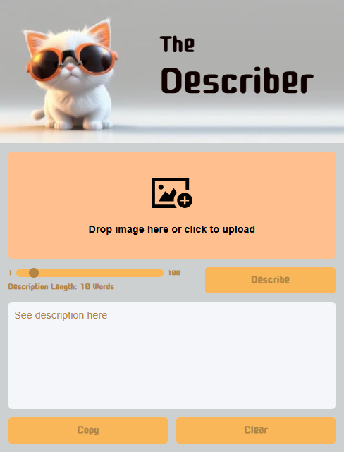

# The Describer

A web application that uses AI to generate descriptive text from uploaded images. Users can drag and drop or click to upload images, adjust the desired description length using a slider (1-100 words), and receive AI-generated descriptions powered by Claude.

The app features a clean, responsive interface with drag-and-drop functionality, loading states, error handling, and copy-to-clipboard capabilities. Users can easily clear their work and start over with new images.

## Status

🚧 **Work in Progress** 

This project is currently under development. 

## Technologies Used

- **Frontend**: HTML5, CSS3, Vanilla JavaScript
- **AI Integration**: Anthropic Claude API
- **Styling**: CSS Grid, Flexbox, Custom Properties
- **Build Tools**: ES6 Modules
- **External Dependencies**: 
  - Anthropic SDK (`@anthropic-ai/sdk`)
  - Google Fonts (Cute Font)
  - Normalize.css

## Screenshots

(Design)

  
---

## TODO

- Task 1  

---

## Notes to Future Self

- Note1

---
## References and Useful Links

Tutorial:  [Intro to Claude AI](https://scrimba.com/claude-ai-c09gsmkso3) at Scrimba.

---