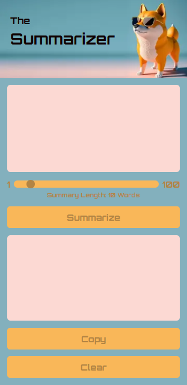

# The Summarizer

A modern web application that transforms lengthy text into concise, customizable summaries using AI-powered natural language processing. 

Users can paste any text content, adjust the desired summary length using an intuitive slider control, and receive intelligent summaries that maintain the original meaning and context.

The application features a clean, responsive interface with real-time feedback, copy-to-clipboard functionality, and comprehensive error handling. Built with accessibility in mind, it provides a seamless experience across desktop and mobile devices.

## Technologies Used

- **HTML5** - Semantic markup with accessibility features
- **CSS3** - Custom styling with CSS Grid, Flexbox, and responsive design
- **Vanilla JavaScript** - ES6+ with async/await for modern functionality
- **Anthropic Claude API** - AI-powered text summarization
- **Google Fonts** - Orbitron typeface for futuristic design

## Status

🚧 **Work in Progress** 

This project is currently under development. 

## Screenshots

(Design)

  
---

## TODO

- Task 1  

---

## Notes to Future Self

- Note1

---
## References and Useful Links

Tutorial:  [Intro to Claude AI](https://scrimba.com/claude-ai-c09gsmkso3) at Scrimba.

---